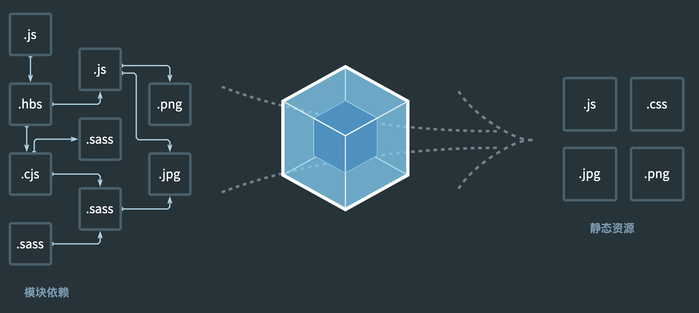
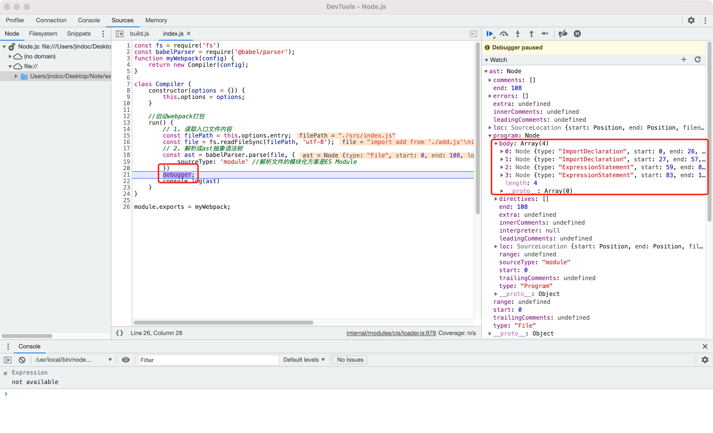

# Webpack



## Webpack核心概念

1. **Entry**

   入口起点，分析构建内部依赖图

2. **Output**

   输出后的资源bundles到哪里，以及如何命名

3. **Loader**

   处理非JavaScript文件（webpack自身只理解JavaScript）

4. **Plugins**

   执行范围更广的任务，从打包优化和压缩，到重新定义环境中的变量等。

5. **Mode**

| 选项        | 描述                                                         | 特点                       |
| ----------- | ------------------------------------------------------------ | -------------------------- |
| development | 会将process.env.NODE_ENV的值设为development。<br />启用NamedChunksPlugin和NamedModulesPlugin。 | 能让代码本地调试运行的环境 |
| production  | 会将process.env.NODE_ENV的值设为production。<br />启用FlagDependencyUsagePlugin，FlagIncludedChunksPlugin，ModuleConcatenationPlugin，NoEmitOnErrorsPlugin，<br />OccurrenceOrderPlugin，SideEffectsFlagPlugin和UglifyJsPlugin | 能让代码优化上线运行的环境 |


## Webpack设置

```shell
yarn add webpack webpack-cli -D
yarn init
# 运行指令

#开发环境
webpack ./src/index.js -o ./build/built.js --mode=development
#生产环境 生成的文件会压缩代码
webpack ./src/index.js -o ./build/built.js --mode=production
```

1. webpack仅能处理js/json资源，不能处理css/img等其他资源
2. 生产环境比开发环境多一个压缩js代码
3. 将ES6模块化编译成浏览器能识别的模块化

### webpack.config.js

基于NodeJS平台运行，模块化采用CommonJS

```shell
yarn add webpack webpack-cli -D #webpack环境
yarn add style-loader css-loader less less-loader -D #样式loader
yarn add file-loader url-loader html-loader -D #处理图片资源
yarn add webpack-dev-server -D #开发环境devServer
```


#### 开发环境配置

```js
const { resolve } = require('path')
const HtmlWebpackPlugin = require('html-webpack-plugin')

module.exports = {
  //webpack配置
  //入口起点
  entry:'./src/index.js',
  //输出
  output: {
    //输出文件名
    filename:'js/built.js',
    //输出路径
    path:resolve(__dirname,'build')
  },
  //loader的配置
  module:{
    rules:[
      //详细loader配置
      //不同文件必须配置不同loader处理
      {
        //匹配哪些文件
        test:/\.css$/,
        //使用哪些loader进行处理
        use:[
          //use数组从右到左执行
          //创建style标签，将js中的样式资源插入进行，添加到head中生效
          'style-loader',
          //将css文件编程CommonJS模块加载js中，里面内容是样式字符串
          'css-loader'
        ]
      },
      {
        test:/\.less$/,
        use:[
          'style-loader',
          'css-loader',
          //将less文件编译成css文件
          'less-loader'
        ]
      },
      {
        //问题：默认处理不了html中的img标签图片
        //处理图片资源
        test:/\.(jpg|png|gif)$/,
        //使用一个loader
        //下载url-loader file-loader
        loader: 'url-loader',
        options:{
          //图片大小小于8kb，就会被base64处理
          //能够减少请求数量（减轻服务器压力），但图片体积更大（请求速度慢）
          limit: 8 * 1024,
          //因为url-loader默认使用es6模块，而html-loader是CommonJS
         	//解析式会出现问题[object Module]
          //关闭url-loader的es6模块化，使用CommonJS解析
          esModule: false,
          name:'[hash:10].[ext]',
          //输出目录到imgs文件夹下
          outputPath:'imgs'
        }
      },
      {
        test:/\.html$/,
        //处理html文件的img图片（负责引入img，从而能被url-loader进行处理）
        loader: 'html-loader',
        options: {
          esModule:false
        }
      },
      {
        //排除css、js、html等资源
        exclude: /\.(css|js|html|less|jpg|png|gif)$/,
        loader: 'file-loader',
        options: {
          name: '[hash:10].[ext]',
          outputPath:'media'
        }
      }
    ]
  },
  //plugins的配置
  plugins:[
    //plugins的配置
    //默认创建一个空的HTML文件，引入打包输出的所有资源（JS/CSS)
    //需求：需要有结构的HTML文件
    new HtmlWebpackPlugin({
      //复制文件，并自动引入所有资源
      template:'./src/index.html'
    })
  ],
  //模式
  mode:'development',
  //mode:'production'
  
  //开发服务器devServer
  //只在内存中编译打包，不会有任何输出
  //启动指令 webpack-dev-server
  devServer: {
    contentBase: resolve(__dirname,'build'),
    //启动gzip压缩
    compress:true,
    //端口号
    port:3000,
    //自动打开浏览器
    open:true
  }
}
```

```shell
#打包
webpack
#devserver运行指令
npx webpack serve #webpack5
npx webpack-dev-server
```

#### 生产环境配置

##### CSS样式文件处理

1. CSS加入JS可能会导致过大，闪屏现象
2. 代码压缩
3. 兼容性
4. ......

```shell
yarn add mini-css-extract-plugin -D #CSS样式文件独立
yarn add postcss-loader postcss-preset-env -D #CSS兼容性处理
yarn add optimize-css-assets-webpack-plugin -D #CSS压缩
yarn add css-minimizer-webpack-plugin -D #CSS压缩webapack5版本使用
```

```js
const { resolve } = require('path')
const HtmlWebpackPlugin = require('html-webpack-plugin')
const MiniCssExtractPlugin = require('mini-css-extract-plugin')
const OptimizeCssAssetsWebpackPlugin = require('css-minimizer-webpack-plugin')

module.exports = {
  entry: './src/js/index.js',
  output: {
    filename: 'js/built.js',
    path: resolve(__dirname,'build')
  },
  module: {
    rules: [
      {
        test:/\.css$/,
        use: [
          //创建style标签，放入样式
          //'style-loader',
          //取代style-loader，提取css成单独文件
          MiniCssExtractPlugin.loader,
          //将css整合到js中
          'css-loader',
          //css兼容性处理
          //帮助postcss找到package.json中的browserslist里面的配置，通过配置加载指定的css兼容性样式
          //'postcss-loader'
          {
            loader: 'postcss-loader',
            options: {
              ident: 'postcss',
              plugins: [
                require('postcss-preset-env')
              ]
            }
          }
        ]
      }
    ]
  },
  plugins:[
    new HtmlWebpackPlugin({
      template:'./src/index.html'
    }),
    new MiniCssExtractPlugin({
      filename: 'css/built.css'
    }),
    //压缩css
    new OptimizeCssAssetsWebpackPlugin()
  ],
  mode:'development'
}
```

```js
//package.json

//设置nodejs环境变量
process.env.NODE_ENV = 'development';

module.exports= {
    "browserslist": {
    //开发环境，设置node环境变量
    "deveplopment":[
      "last 1 chrome version",
      "last 1 firefox version",
      "last 1 safari version"
    ],
    "production": [
      ">0.2%",
      "not dead",
      "not op_mini all"
    ]
  }
}

```

##### JS逻辑文件处理

###### 语法检查Eslint

```shell
yarn add eslint-loader eslint -D #语法检查eslint
#eslint-config-airbnb-base插件符合airbnb的一些规则
yarn add eslint-loader eslint eslint-plugin-import eslint-config-airbnb-base -D
```

###### 兼容性问题Babel

1. 基本兼容性处理 @babel/preset-env
2. 全部js兼容性处理 @babel/preset-env 体积过大
3. 按需加载 corejs

```js
import '@babel/polyfill'

//es6语法 在ie浏览器会报错
const add = (x, y) => {
  return x + y;
};
console.log(add(2, 5));

//promise不能转换，使用全部兼容性处理
const promise = new Promise((resolve) => {
  setTimeout(() => {
    console.log("finish");
    resolve();
  }, 1000)
})
console.log(promise);
```

```shell
yarn add babel-loader @babel/preset-env @babel/core -D #babel兼容性
yarn add @babel/polyfill #全部的兼容性处理
yarn add core-js -D #按需加载兼容性
```

###### JS及HTML压缩

对于JavaScript，mode设置为production，UglifyJsPlugin自动压缩。

通过HtmlWebpackPlugin配置压缩html文件

配置文件：

```js
const { resolve } = require('path')
const HtmlWebpackPlugin = require('html-webpack-plugin')

module.exports = {
  entry: './src/js/index.js',
  output: {
    filename: 'js/built.js',
    path: resolve(__dirname,'build')
  },
  module: {
    rules: [
      //语法检查，设置检查规则需要在package.json的eslintConfig中设置
      {
        test:'/\.js$/',
        //排除第三方库中的代码
        exclude: /node_modules/,
        loader:'eslint-loader',
        options:{
          //自动修复eslint错误
          fix: true
        }
      },
      {
        test:/\.js$/,
        exclude:/node_modules/,
        loader:'babel-loader',
        options: {
          //预设：指示babel做什么兼容性处理
          //presets: ['@babel/preset-env']
          presets: [
            '@babel/preset-env',
            {
              //按需加载
              useBuiltIns:'usage',
              //注定core-js版本
              corejs: {
                version: 3
              },
              //指定兼容性做到哪个版本的浏览器
              targets: {
                chrome: '60',
                firefox: '60',
                ie: '9',
                safari: '10',
                edge: '17'
              }
            }
          ]
        }
      }
    ]
  },
  plugins:[
    new HtmlWebpackPlugin({
      template:'./src/index.html',
      minify: {
        // 折叠空格
        collapseWhitespace: true,
        // 移除注释
        removeComments: true
      }
    })
  ],
  mode:'development'
}
```

```js
//package.json
module.exports = {
  "eslintConfig":{
    "extends": "airbnb-base"
  }
}
```

针对特定行可以使eslint所有规则都失效（不进行检查）

```js
// eslint-disable-next-line
console.log("hello")
```

##### 生产环境配置文件

```js
const { resolve } = require('path')
const HtmlWebpackPlugin = require('html-webpack-plugin')
const MiniCssExtractPlugin = require('mini-css-extract-plugin')
const OptimizeCssAssetsWebpackPlugin = require('css-minimizer-webpack-plugin')

//复用loader
const commonCssLoader = [
  MiniCssExtractPlugin.loader,
  'css-loader',
  {
    //需要在package.json中定义browserslist并设置NODE_ENV
    loader: 'postcss-loader',
    options: {
      ident:'postcss',
      plugins: [
        require('postcss-preset-env')
      ]
    }
  }
]

//配置
module.exports = {
  entry: './src/js/index.js',
  output: {
    filename: 'js/built.js',
    path: resolve(__dirname,'build'),
  },
  module: {
    rules: [
      {
        test:/\.css$/,
        use: [...commonCssLoader]
      },
      {
        test:/\.less$/,
        use: [...commonCssLoader,'less-loader']
      },
      //当一个文件要呗多个loader处理，一定要指定loader的执行先后顺序
      //先执行eslint，再执行babel
      {
        //在package.json中eslintConfig配置
        test:/\.js$/,
        exclude: /node_modules/,
        //优先执行此loader
        enforece: 'pre',
        loader: 'eslint-loader',
        options: {
          fix: true
        }
      },
      {
        test:/\.js$/,
        exclude: /node_modules/,
        loader: 'babel-loader',
        options: {
          presets: [
            '@babel/preset-env',
            {
              userBuiltIns: 'usage',
              corejs: {version: 3},
              targets: {
                chrome: '60',
                firefox: '50'
              }
            }
          ]
        }
      },
      {
        test:/\.(jpg|png|gif)$/,
        loader: 'url-loader',
        options: {
          limit: 8 * 1024,
          name: '[hash:10].[ext]',
          outputPath: 'imgs',
          esModule: false
        }
      },
      {
        test:/\.html$/,
        loader: 'html-loader',
        options: {
          esModule: false
        }
      },
      {
        exclude:/\.(js|css|less|html|jpg|png|gif)$/,
        loader: 'file-loader',
        options: {
          outputPath: 'media'
        }
      }
    ]
  },
  plugins: [
    new MiniCssExtractPlugin({
      filename:'css/built.css'
    }),
    new OptimizeCssAssetsWebpackPlugin(),
    new HtmlWebpackPlugin({
      template: './src/index.html',
      minify: {
        collapseWhitespace: true,
        removeComments: true
      }
    })
  ],
  mode:'production'
}
```

## Webpack优化

### 开发环境

#### HMR

Hot module replacement：一个模块发生变化，只会重新打包这一个模块（而不是打包所有模块），极大提升构建速度。

1. css：style-loader已经实现
2. js：默认不使用HMR，需要修改js代码，添加支持HMR功能的代码，只能处理非入口js文件的其他文件。
3. html：默认不能使用HMR

```js
//webpack.config.js 开启HMR
const webpack = require("webpack")

module.exports = {
	...,
	devServer:{
      hot: true
    },
    plugins:[
    	new webpack.HotModuleReplacementPlugin()
    ]
}
```

```js
if(module.hot) {
  //设置为true，则开启了HMR功能
  module.hot.accept('./print.js', function () {
    // 方法监听print.js文件的变化，一旦发生变化，其他默认不会重新打包构建。
    print()
  })
}
```

#### source-map

提供源代码到构建后代码映射技术。如果构建后代码出错了，通过映射关系追踪到源代码错误。

```js
//[inline-|hidden-|eval-][nosources-][cheap-[module-]]source-map
//webpack.config.js
module.exports = {
  devtool:'inline-source-map'
}
```

内联和外联的区别：外部生成了文件，内联没有；内联构建速度更快。

source-map：外部 错误代码的准确信息和源代码的错误位置
inline-sourcemap：内联
hidden-source-map：外部 提示到错误代码的原因，但没有错误位置，不能追踪到源代码的错误
eval-source-map：内联 每个文件都生成对应的source-map，都在eval
nosource-source-map：外部 可以定位到错误代码的准确信息，但没有源代码的信息
cheap-source-map：外部 源文件报错整行，仅精确到行
cheap-module-source-map：外部 错误代码准确信息和源代码的错误位置。

**开发环境**：速度快，调试更友好
速度快（eval>inline>cheap>...）eval-cheap-source-map、eval-source-map
调试友好 source-map、cheap-module-source-map

**生产环境**：源代码要不要隐藏？调试要不要更友好

### 生产环境

#### oneOf

```js
module.exports = {
  module: {
    rules: [
      {
        //以下loader只会匹配一个
        //注意：不能有两项配置处理同一个类型的文件
        oneOf: [
          {
            test:/\.css$/,
            use: [...commonCssLoader]
          },
          {
            test:/\.less$/,
            use: [...commonCssLoader,'less-loader']
          },
        ]
      }
    ]
  },
}
```

#### 缓存

##### babel缓存

```js
{
  test: /\.js$/,
  exclude: /node_modules/,
  loader: 'babel-loader',
    options: {
      presets: [
        '@babel/preset-env',
        {
          userBuiltIns: 'usage',
          corejs: {version: 3},
          targets: {
            chrome: '60',
            firefox: '50'
          }
        }
      ],
        //开启babel缓存
        //第二次构件时，会读取之前的缓存
        cacheDirectory: true
    }
},
```

##### 文件资源缓存

1. **hash**：修改文件名加入hash值，每次webpack打包会生成唯一的hash值。

问题：由于使用同一个hash值，如果重新打包会导致所有缓存失效。

```js
module.exports = {
  entry: './src/js/index.js',
  output: {
    filename: 'js/built.[hash:10].js',
    path: resolve(__dirname,'build')
  }
  plugins: [
    new MiniCssExtractPlugin({
    	filename:'css/built.[hash:10].css'
  	}),
  ]
}
```

2. chunkhash：根据chunk生成has值，如果来源同一个chunk，那么hash值就一样。
3. contenthash：根据文件内容生成hash。不同文件hash不一样

#### tree shaking

去除无用代码，减少代码体积。

1. 必须使用ES6模块化
2. 开启production

```js
//pacakge.json

//所有代码都没有副作用（都可以进行tree shaking）
//此时会导致css/ @babel/polyfill等文件被删除
"sideEffects": false

//过滤
"sideEffects": ["*.css","*.less"]
```

#### code split

代码分割，按需加载。

1. **方式1**

```js
const { resolve } = require('path')
const HtmlWebpackPlugin = require('html-webpack-plugin')

//配置
module.exports = {
  // 单入口
  // entry: './src/js/index.js'
  // 多入口
  entry: {
    main:'./src/js/index.js',
    test:'./src/js/test.js'
  },
  output: {
    filename: 'js/[name].[contenthash:10].js',
    path: resolve(__dirname,'build'),
  },
  plugins: [
    new HtmlWebpackPlugin({
      template: './src/index.html',
      minify: {
        collapseWhitespace: true,
        removeComments: true
      }
    })
  ],
  mode:'production'
}
```

2. **方式2**

```js
//可配合多入口

//将node_modules中代码单独打包一个chunk最终输出
//按需引入，对于公共依赖会打包成单独一个chunk，多页面不会重复加载，单独加载。
module.exports = {
  optimization: {
    splitChunks: {
      chunks: 'all'
    }
  }
}
```

3. **方式3**

```js
// import动态导入
//通过js代码，让某个文件单独打包成chunk
//此时test.js会单独打包
import(/* webpackChunkName: 'test' */'./test')
	.then(({mul, count}) => {
  	mul(1, 2);
	})
	.catch(() => {
  	console.log('加载成功')
	})
```

#### 懒加载与预加载

```js
//import { mul } from './test'
document.getElementById('btn').onclick = function() {
  // 懒加载
  // 预加载 Prefetch：会在使用前提前加载js文件
  //正常加载时并行加载，预加载资源在浏览器空闲时再加载。
  import(/* webpackChunkName: 'test', webpackPrefetch: true */'./test')
  	.then(({ mul }) => {
    	console.log(mul(4, 5));
  	})
}
```

#### PWA

渐进式网络开发应用程序（离线可访问）

```shell
yarn add workbox-webpack-plugin -D #workbox
```

```js
const { resolve } = require('path')
const HtmlWebpackPlugin = require('html-webpack-plugin')
const WorkboxWebpackPlugin = require('workbox-webpack-plugin')

module.exports = {
  entry: './src/js/index.js'
  output: {
    filename: 'js/[name].[contenthash:10].js',
    path: resolve(__dirname,'build'),
  },
  plugins: [
    new HtmlWebpackPlugin({
      template: './src/index.html',
      minify: {
        collapseWhitespace: true,
        removeComments: true
      }
    }),
    new WorkboxWebpackPlugin.GenerateSW({
      //帮助serviceworker快速启动
      //删除旧的serviceworker
      //生成一个serviceworker配置文件
      clientsClaim: true,
      skipWaiting: true
    })
  ],
  mode:'production'
}
```

```js
//index.js 入口文件
if('serviceWorker' in navigator) {
  window.addEventListener('load', () => {
    navigator.serviceWorker.register('./service-worker.js')
    	.then(() => {
      	console.log('succ')
    	})
    	.catch(() => {
	      console.log('err')
    	});
  });
}
```

```json
//package.json
//若配置了eslint，针对于window、navigator等eslint会报错，修改配置解决
"eslintConfig": {
  "extends": "airbnb-base",
  "env": {
    //支持浏览器
    "browser": true
  }
}
```

#### 多进程打包

```shell
yarn add thread-loader -D
```

```js
{
  test: /\.js$/,
  exclude: /node_modules/,
  use: [
    //开启多进程打包，启动大概需要600ms
    //工作消耗时间长，才需要多进程打包
    {
      loader:'thread-loader',
      options: {
        workers: 2 //进程数
      }
    },
    {
      loader: 'babel-loader',
      options: {
        presets: [
          '@babel/preset-env',
          {
            userBuiltIns: 'usage',
            corejs: {version: 3},
            targets: {
              chrome: '60',
              firefox: '50'
            }
          }
        ],
        //开启babel缓存
        //第二次构件时，会读取之前的缓存
        cacheDirectory: true
      }
    }
  ]
},
```

#### externals

```js
const { resolve } = require('path')
const HtmlWebpackPlugin = require('html-webpack-plugin')

//配置
module.exports = {
  entry: './src/js/index.js',
  output: {
    filename: 'js/[name].[contenthash:10].js',
    path: resolve(__dirname,'build'),
  },
  plugins: [
    new HtmlWebpackPlugin({
      template: './src/index.html',
      minify: {
        collapseWhitespace: true,
        removeComments: true
      }
    })
  ],
  mode:'production',
  externals:{
    //需要手动引入CDN链接
    //忽略库名 -- npm库中的包名
    jquery: 'jQuery'
  }
}
```

#### dll 动态链接库

```shell
yarn add add-asset-html-webpack-plugin -D #
```

```js
//webpack.dll.js
//使用dll技术对某些库进行单独打包，例如jquery、react、vue...
//当运行webpack时候，默认查找webpack.config.js配置文件，因此需要指定webpack --config webpack.dll.js
const { resolve } = require('path');
const webpack = require('webpack');
module.exports = {
  entry: {
    jquery: ['jquery']
  },
  output: {
    filename: '[name].js',
    path:resolve(__dirname,'dll'),
    library: '[name]_[hash]' //打包的库里面想外暴露出取得内容叫什么名字
  },
  plugins: [
    //打包生成一个manifest.json文件，提供和jquery映射
    new webpack.DllPlugin({
      name: '[name]_[hash]', //映射库暴露的内容名称
      path: resolve(__dirname, 'dll/manifest.json') //输出文件路径
    })
  ],
  mode:'production'
}
```

```shell
webpack --config webpack.dll.js #生成jquery.js和manifest.json
```

```js
//webpack.config.js

const { resolve } = require('path')
const HtmlWebpackPlugin = require('html-webpack-plugin')
const webpack = require('webpack');
//将某个文件打包输出，并在html中自动引入该资源
const AddAssetHtmlWebpackPlugin = require('add-asset-html-webpack-plugin')
//配置
module.exports = {
  entry: './src/js/index.js',
  output: {
    filename: 'js/[name].[contenthash:10].js',
    path: resolve(__dirname,'build'),
  },
  plugins: [
    new HtmlWebpackPlugin({
      template: './src/index.html',
      minify: {
        collapseWhitespace: true,
        removeComments: true
      }
    }),
    //告诉webpack那些库不参与打包。同时使用时的名称也需要修改
    new webpack.DllReferencePlugin({
      manifest: resolve(__dirname, 'dll/manifest.json')
    }),
    // 将文件打包出去，并在html中自动引入该资源
    new AddAssetHtmlWebpackPlugin({
      filename:resolve(__dirname, 'dll/jquery.js')
    })
  ],
  mode:'production',
}
```

## Webpack配置详解

### entry

1. string值

   制定一个js文件作为入口，打包形成一个chunk，输出一个bundle。默认名称为main

2. array值

   最终只形成一个chunk，输出出去只有一个bundle。只有在HMR功能中让html热更新生效。

3. object值

   形成多个chunk，输出多个bundle。

```js
const { resolve } = require('path')
const HtmlWebpackPlugin = require('html-webpack-plugin')

//配置
module.exports = {
  // entry: './src/index.js',
  // entry: ['./src/index.js', './src/test.js'],
  entry: {'./src/index.js', './src/test.js'},
  output: {
    filename: '[name].js',
    path: resolve(__dirname,'build'),
  },
  plugins: [
    new HtmlWebpackPlugin(),
  ],
  mode:'development',
}
```

### output

```js
output: {
  //文件名称
  filename: 'js/[name].js',
  //输出文件目录
  path: resolve(__dirname, 'build'),
  // 所有资源引入公共路径前缀 imgs/a.jpg --> /imgs/a.jpg
  publicPath:'/',
  //非入口chunk的名称 动态import或者optimization中的配置
  chunkFilename: '[name]_chunk.js', //在js动态引用中写注释改名
  // 整个库向外暴露的变量名
  library: '[name]',
  libraryTarget: 'window' //变量明天加到哪个上browser、node端global、amd、commonjs等
}
```

### loader

```js
module: {
  rules: [
    {
      test:/\.css$/,
      //多个loader用use
      use:['style-loader','css-loader']
    },
    {
      test: /\.js$/,
      //排除
      exclude: /mode_module/,
      //只检查src下的js
      include: resolve(__dirname,'src'),
      //优先执行
      enforce:'pre',
      //延后执行
      //enforce:'post'
      //单个loader用loader
      loader: 'eslint-loader'
    },
    {
      //以下配置只会生效一个
      oneOf:[]
    }
  ]
}
```

### resolve

```js
//解析模块的规则
resolve: {
  //配置解析模块路径别名 在写路径时候可以简写成 import '$css/index.css'
  alias: {
    $css: resolve(__dirname,'src/css')
  },
  //配置文件省略文件路径的后缀名
  extensions: ['.js', '.json', '.jsx', '.css'],
  //告诉webpack解析模块时去哪个目录找
  modules: [resolve(__dirname,'../../node_modules'),'node_modules']
}
```

### devServer

```js
devServer: {
  //运行代码的目录
  contentBase: resolve(__dirname, 'build'),
  //监视文件目录下的所有文件，一旦变化就会reload
  watchContentBase: true,
  watchOptions: {
    //忽略文件
    ignored: /node_modules/
  }
  //启动gzip压缩
  compress: true,
  port: 5000,
  host: 'localhost',
  open: true,
  hot: true,
  //日志等级
  clientLogLevel: 'none',
  //除了基本启动信息，其他内容不打印
  quiet: true,
  //如果出错了，不要全屏提示
  overlay: false
  //服务器代理，开发环境跨域
  proxy: {
    '/api': {
      target: 'http://localhost:3000',
      pathRewrite: { //路径重写
        '^/api': ''
      }
    }
  }
}
```

### optimization

```js
//需要引入 const TerserWebpackPlugin = require('terser-webpack-plugin')

optimization: {
  splitChunks: {
    chunks: 'all',
    //下面一般情况均为默认值
    minSize: 30 * 1024 //分割的chunk最小为30kb
    maxSize: 0,
    minChunks: 1, //要提取的chunk最少被引用1次
    maxAsyncRequests: 5, //按需加载时，并行加载文件的最大数量
    maxInitialRequest: 3, //入口js文件最大并行请求数量
    automaticNameDelimiter: '~', //名称连接符
    name: true, //可以使用命名规则
    cacheGroups: { //分割chunk的组
      //node_modules文件会被打报到vendors组的chunk中 vendors~xxx.js
      //满足上面的公共规则，如超过30kb，至少被引用一次
      vendors: {
        test: /[\\/]node_modules[\\/]/,
        //优先级
        priority: -10
      },
      default: {
        minChunks: 2,
        priority: -20,
        //如果当前要打包的模块，和之前已经提取的模块是同一个，就会复用，俄日不是重新打包模块
        reuseExistingChunk: true
      }
    }
  },
  //将当前模块的记录其他模块的hash单独打包为一个文件runtime
  //否则在修改其他模块代码时，当晚模块引用的hash值需要变化，引发缓存失效
  runtimeChunk: {
    name: entrypoint => `runtime-${entrypoint.name}`
  },
  minimize: true,
  minimizer: {
    //配置生产环境压缩方案：js/css
    new TerserWebpackPlugin({
      //开启缓存
      cache: true,
      //开启多进程打包
      parallel: true,
      //启用source-map
      sourceMap: true,
      terserOptions: {
        // https://github.com/webpack-contrib/terser-webpack-plugin#terseroptions
      }
    })
  }
}
```

## Webpack5

```js
//webapck.config.js

//webpack4
const { resolve } = require('path')
module.exports = {
  entry:'./src/index.js',
  output: {
    filename:'js/built.js',
    path:resolve(__dirname,'build')
  },
  mode:'development',
}

//webpack5 其他均为默认配置
module.exports = {
  mode: 'development'
}
```

1.  通过持久缓存提高构建性能
2. 使用 更好地算法和默认值来改善长期缓存
3. 更好的树摇和代码生成来改善捆包大小

可以不使用webpackChunkName来为chunk命名（开发环境），生产环境还是有必要的。

可以对嵌套模块tree shaking，可以对Commonjs的tree shaking

通过output.ecmaVersion:2015 来指定es6输出代码

### SplitChunk

```js
//webpack4
minSize: 30000,

//webpack5
minSize: {
  javascript: 30000,
  style: 20000,
}
```

### Caching

```js
//配置缓存
cache: {
  //磁盘存储
  type:'filesystem',
  buildDependencies: {
    //当配置修改时，缓存失效
    config: [__filename]
  }
}
//缓存将存储到node_modules/.cache/webpack
```

### 默认值

```js
entry: './src/index.js',
output: {
  filename:'[name].js',
  path:resolve(__dirname,'dist')
},
```

## Webpack高级

### vue-cli脚手架原理

```shell
vue create vue_cli
vue inspect --mode=deveplopment > webpack.dev.js #将环境配置输出
vue inspect --mode=production > webpack.prod.js
```

具体配置见webpack.dev.js及webpack.prod.js。

### webpack配置

#### Loader

##### 定义loader

本质是一个函数

```js
// webpack.config.js
const path = require('path')
module.exports = {
  module: {
    rules: [
      test: /\.js$/,
      //loader: 'loader1.js'
      // 执行顺序为 loader1pitch loader2pitch loader3pitch loader3 loader2 loader1
      use: [
      	'loader1',
      	'loader2',
      	{
        	loader:'loader3',
        	options: {
        		name: 'jack'
        	}
        }
      ]
    ]
	},
  //配置loader解析规则
  resolveLoader: {
    modules:[
      'node_modules',
      path.resolve(__dirname, 'loaders')
    ]
  }
}
```

```js
// loaders/loader1.js
//loader本质是一个函数
//同步方式1
module.exports = function(content, map, meta) {
  console.log(content);
  return content;
}

//同步方式2
module.exports = function(content, map, meta) {
  console.log(content);
  this.callback(null, content, map, meta)
}

//异步方式
module.exports = function(content, map, meta) {
  console.log(content);
  const callback = this.async();
  setTimeout(() => {
      callback(null, content);
  },1000)
}

//会相反解析，首先执行pitch方法
module.export.pitch function() {
  console.log('pitch')
}
```

##### loader配置获取及校验

```shell
yarn add loader-utils schema-utils -D
```

```js
const { getOptions } = require('loader-utils');
const { validate } = require('schema-utils');
const schema = require('./schema')
module.exports = function(content, map, meta) {
  //获取options
  const options = getOptions(this);
  console.log(options);
  //校验options是否合法
  validate(schema, options, {
      name: 'loader-name'
  })
  return content;
}
```

```json
// schema.json
{
    "type": "object",
    "properties": {
        "name": {
            "type": "string",
            "description": "名称"
        }
    },
    //允许追加属性
    "additionalProperties": true
}
```

##### 自定义babel-loader

```js
const { getOptions } = require('loader-utils');
const { validate } = require('schema-utils');
const babel = require('@babel/core');
const uilt = require('util');

const schema = require('./babelSchema')

//babel.transform用来编译代码的方法
//是一个普通异步方法
//util.promisify将普通异步方法转化成基于promise的异步方法。
const transform = util.promisify(babel.transform);

module.exports = function(content, map, meta) {
    const options = getOptions(this) || {};
    validate(schema, options, {
       	name:"Babel Loader"
    });
    //创建异步
    const callback = this.async();
    //使用babel编译代码
    transform(content, options)
    	.then(({code, map}) => callback(null, code, map, meta))
    	.catch((e) => callback(e))
}
```

```json
// babelSchema.json
{
    "type": "object",
    "properties": {
        "presets": {
            "type": "array",
        }
    },
    //允许追加属性
    "additionalProperties": true
}
```

#### Plugin

主要为compiler钩子（运行）和compilation钩子（编译）。

compiler钩子extend自Tapable类，用来注册和调用插件。

##### Tapable

```shell
yarn add tapable -D
```

```js
const { SyncHook, SyncBailHook, AsyncParallelHook, AsyncSeriesHook } = require('tapable');

class Lesson {
  constructor() {
    //初始化hooks容器
    this.hooks = {
      //同步钩子
      go: new SyncHook(['address'])
      //一单有返回值则退出，不会继续向下执行hooks
      //go: new SyncBailHook(['address'])
      
      //异步钩子
      //异步并行钩子，两个函数会并行输出。
      leave: new AsyncParalleHook(['name','age'])
      //异步串行，按顺序运行
      //leave: new AsyncSeriesHook(['name','age'])
    }
  }
  tap() {
    //往hooks中注册事件/添加回调函数
    this.hooks.go.tap('classroom1', (address) => {
      console.log('classroom1', address)
      return 0;
    })
    this.hooks.go.tap('classroom2', (address) => {
      console.log('classroom2', address)
    })
    
    this.hooks.leave.tapAsync('classroom3', (name, age, callback) => {
      setTimeout(() => {
        console.log(name,age);
        callback();
      },1000)
    })
    //返回一个Promise
    this.hooks.leave.tapPromise('classroom3', (name, age) => {
      return new Promise((resolve) => {
        setTimeout(() => {
          console.log(name,age);
          resolve();
        },1000)
      })
    })
  }
  start() {
    //触发hooks
    this.hooks.go.call('c318');
    this.hooks.leave.callAsync('jack',18, function() {
      //代表所有leave容器中的函数触发完了，才触发
      console.log('end')
    });
  }
}

const l = new Lesson();
l.tap();
l.start();
```

##### compiler钩子

具体钩子见官方文档

```shell
yarn add webpack wepack-cli -D
```

```js
//webpack.config.js
const Plugin1 = require('./plugins/Plugin1')

module.exports = {
  plugins: [
    new Plugin1()
  ]
}
```

```js
class Plugin1 {
  apply(compiler) {
    compiler.hooks.emit.tap('Plugin1', (compilation) => {
      console.log('emit.tap 1')
    })
    compiler.hooks.emit.tapAsync('Plugin1', (compilation, cb) => {
      setTimeout(() => {
        console.log('emit.tap 1')
        cb()
      },1000)
    })
    compiler.hooks.afterEmit.tap('Plugin1', (compilation) => {
      console.log('afterEmit.tap 1')
    })
    compiler.hooks.done.tap('Plugin1', (stats) => {
      console.log('done.tap 1')
    })
  }
}
module.exports = Plugin1;
```

##### compilation钩子

```js
const fs = require('fs');
const util = require('util');
const path = require('path')
const webpack = require('webpack')
const { RawSource } = webpack.sources;
//将fs.readFile编程基于promise风格的异步方法
const readFile = util.promisify(fs.readFile);
class Plugin2 {
  apply(compiler) {
    //初始化compilation钩子
    compiler.hooks.thisCompilation.tap('Plugin2', (compilation) => {
      debugger
      console.log(compilation)
      const content = 'hello plugin2'
      compilation.hooks.additionalAssets.tapAsync('Plugin2', (cb) => {
        //往要输出资源中，添加一个文件
        compilation.assets['a.txt'] = {
          //文件大小
          size() {
            return content.length;
          },
          //文件内容
          source() {
            return content;
          }
        }
        const data = await readFile(path.resolve(__dirname,'b.txt'));
        compilation.assets['b.txt'] = new RawSource(data);
        //等价方式
        compilation.emitAsset('b.txt',new RawSource(data));
        cb();
      })
    })
  }
}
module.exports = Plugin2;
```

```shell
#调试webpack,首行断点
node --inspect-brk ./node_modules/webpack/bin/webpack.js
```

##### 自定义copy-webpack-plugin

```js
//webpack.config.js
const CopyWebpackPlugin = require('./plugins/CopyWebpackPlugin')
module.exports = {
  plugins: [
    new CopyWebpackPlugin({
      from: 'public',
      //to : '.',
      ignore: ['**/index.html']
    })
  ]
}
```

```json
//schema.json
{
  "type":"object",
  "properties": {
    "from": {
      "type": "string"
    },
    "to": {
      "type": "string"
    },
    "ignore": {
      "type": "array"
    }
  },
  "additionalProperties": false
}
```

```js
//CopyWebpackPlugin
const { validate } = require('schema-utils');
const globby = require('globby')
const schema = require('./schema')
const path = require('path')
const webpack = require('webpack')
const fs = require('fs')
const util = require('util');

const { RawSource } = webpack.sources;
//将fs.readFile编程基于promise风格的异步方法
const readFile = util.promisify(fs.readFile);

class CopyWebpackPlugin {
  constructor(option = {}) {
    //验证options参数
    validate(schema, option, {
      name:"CopyWebpackPlugin"
    }
    this.options = options;
  }
  
  apply(compiler) {
    compiler.hooks.thisCompilation.tap('CopyWebpackPlugin', (compilation) => {
      //添加资源的钩子函数
      compilation.hooks.additionalAssets.tapAsync('CopyWebpackPlugin', async (cb) => {
        //将from中的资源复制到to下面输出
        //读取from中所有资源，过滤ignore的文件，生成webpack格式的资源，添加到compilation中输出
        const { from, ignore } = this.options;
        const to = this.options.to ? this.options.to : '.';
        
        // 1. 获取webpack配置中的上下文路径
        const context = compiler.options.context; // process.cwd()
        const absoluteFrom = path.isAbsolute(from) ? from : path.resolve(context, from);
        //globby(要处理的文件夹，options)
        const paths = await globby(absoluteFrom, { ignore });
        
        // 2. 读取paths中所有资源
        const files = await Promise.all(
          paths.map(async (absolutePath) => {
            //读取文件
            const data = await readFile(absolutePath);
            const relativePath = path.basename(absolutePath);
            //和to属性结合
            const filename = path.join(to, relativePath);
            return {
              data,
              filename
            }
          })
        )
        // 3. 生成webpack格式资源
        const assets = files.map((file) => {
          const source = new RawSource(file.data);
          return {
            source,
            filename: file.filename
          }
        })
        // 4. 添加compilation中
        assets.forEach((asset) => {
          compilation.emitAsset(asset.filename, asset.source);
        })
        
        cb();
      })
    })
  }
}
module.exports = CopyWebpackPlugin;
```

### Webpack执行流程

1. 初始化Compiler：new Webpack(config) 得到 Compiler 对象。
2. 开始编译：用上一步得到的参数初始化 Compiler 对象，加载所有配置的插件，执行对象的run 方法开始执行编译；
3. 确定入口：根据配置中的 entry 找出所有的入口文件；
4. 编译模块：从入口文件出发，调用所有配置的 Loader 对模块进行翻译，再找出该模块依赖的模块，再递归本步骤直到所有入口依赖的文件都经过了本步骤的处理；
5. 完成模块编译：在经过第4步使用 Loader 翻译完所有模块后，得到了每个模块被翻译后的最终内容以及它们之间的依赖关系；
6. 输出资源：根据入口和模块之间的依赖关系，组装成一个个包含多个模块的 Chunk，再把每个 Chunk 转换成一个单独的文件加入到输出列表，这步是可以修改输出内容的最后机会；
7. 输出完成：在确定好输出内容后，根据配置确定输出的路径和文件名，把文件内容写入到文件系统。

　　在以上过程中，Webpack 会在特定的时间点广播出特定的事件，插件在监听到感兴趣的事件后会执行特定的逻辑，并且插件可以调用 Webpack 提供的 API 改变 Webpack 的运行结果。

### 自定义一个Webpack

具体代码见myWebpack

**P1**：通过@babel/parse生成的抽象语法树，对应于index.js文件的四条语句。



